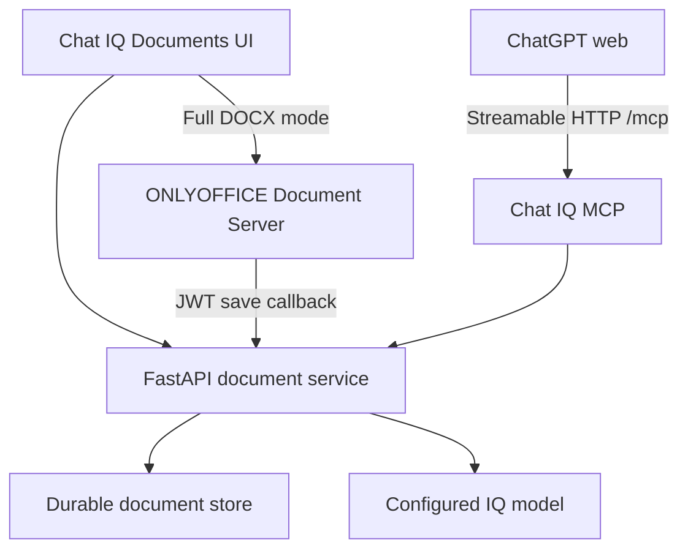

# Chat IQ Documents

Chat IQ Documents is the first office application in the Chat IQ suite. It combines a fast AI-native web editor, a full DOCX engine, and a remote MCP server that ChatGPT can use to read and safely edit documents.

This is the first production-oriented vertical slice, not a claim that every Word or Google Docs feature is already complete. The architecture deliberately separates the quick editing experience from the high-fidelity office engine so advanced DOCX behavior can grow without turning the main interface into a wall of controls.

## What is implemented

| Layer | Capability |
|---|---|
| Fast editor | Tiptap-based rich text, headings, lists, links, images, tables, alignment, fonts, colors, highlights, undo/redo and responsive A4 canvas |
| IQ panel | English UI, selected-text context, reviewable before/after proposals, confidence, rationale, Apply and Discard |
| Persistence | Durable local document adapter, HTML sanitization, optimistic versions, serialized autosave and DOCX generation |
| Full office mode | ONLYOFFICE Document Server with editing, pagination, comments, review, co-editing, download and autosave callbacks |
| REST | Document CRUD, exact replacement, export, IQ proposal/application and ONLYOFFICE integration |
| MCP | Search, fetch, list, read, create, append, exact replace, propose, apply and guarded delete tools |
| Security | Password protection for the app, short-lived JWT file URLs for ONLYOFFICE, callback host allowlist, write/destructive annotations and optional GitHub OAuth for ChatGPT |



## Start with Docker

Copy the relevant values from `.env.example`, then start both Chat IQ and ONLYOFFICE:

```bash
export ONLYOFFICE_JWT_SECRET="replace-with-a-long-random-secret"
docker compose -f docker-compose.iq.yml up --build
```

Open:

- Chat IQ Documents: `http://localhost:8502/documents`
- REST API: `http://localhost:5055/docs`
- MCP: `http://localhost:5055/mcp`
- ONLYOFFICE: `http://localhost:8080`

The native editor works without ONLYOFFICE. Full DOCX mode requires the Document Server URL to be reachable by the browser and the Chat IQ API to be reachable by Document Server.

## Run and connect from an iPad

No desktop computer is required. GitHub Codespaces and ChatGPT both work in an iPad browser.

1. Open this repository in Safari or Chrome.
2. Choose **Code → Codespaces → Create codespace** on the Chat IQ branch.
3. Add `ONLYOFFICE_JWT_SECRET` under the repository's **Settings → Secrets and variables → Codespaces**. A long random value is sufficient.
4. For secure GitHub OAuth, also add the variables from the next section.
5. In the Codespaces browser terminal run:

   ```bash
   ./scripts/start-chat-iq-codespaces.sh
   ```

6. Open the **Ports** tab and make ports `8502`, `5055`, and `8080` public. This is a temporary development deployment; Codespaces can stop when idle.
7. Open the URL printed for Chat IQ Documents.

For permanent use, deploy the same Compose services to a container host with persistent volumes and HTTPS domains. Keep the API/MCP and ONLYOFFICE URLs stable.

## Recommended ChatGPT authentication: GitHub OAuth

ChatGPT developer-mode apps support OAuth or no authentication, not a hand-entered static bearer password. GitHub OAuth is therefore included for a personal deployment.

1. In GitHub, open **Settings → Developer settings → OAuth Apps → New OAuth App**.
2. Set the homepage to the public Chat IQ URL.
3. Set the authorization callback to:

   ```text
   https://YOUR-API-HOST/auth/callback
   ```

4. Create these deployment or Codespaces secrets:

   ```text
   IQ_MCP_AUTH_MODE=github
   IQ_MCP_PUBLIC_URL=https://YOUR-API-HOST
   IQ_MCP_GITHUB_CLIENT_ID=...
   IQ_MCP_GITHUB_CLIENT_SECRET=...
   IQ_MCP_GITHUB_LOGIN=MarkosmmaDaraHara
   IQ_MCP_JWT_SIGNING_KEY=another-long-random-secret
   FASTMCP_HOME=/app/data/fastmcp
   ```

Only the configured GitHub login is accepted. OAuth registrations and tokens are encrypted and should be stored on the persistent application volume.

For a short, non-sensitive test you may use `IQ_MCP_AUTH_MODE=none` and select **No Authentication** in ChatGPT. Never expose confidential documents this way. `password` mode remains useful for MCP clients that can send the `OPEN_NOTEBOOK_PASSWORD` bearer token, but it is not the ChatGPT web connection path.

## Add Chat IQ to ChatGPT web

Use ChatGPT in the browser; developer mode is currently configured on the web interface.

1. Open **Settings → Security and login** and enable **Developer mode**.
2. Open [ChatGPT Plugins](https://chatgpt.com/plugins) and select the plus button.
3. Name the app **Chat IQ Documents**.
4. Enter the public HTTPS endpoint including `/mcp`, for example `https://iq-api.example.com/mcp`.
5. Choose **OAuth** for the GitHub setup above, or **No Authentication** only for a temporary protected test environment.
6. Review the discovered tools and create the connection.
7. Start a new chat, enable Chat IQ Documents in the tools menu, and try:

   > Find my Project proposal in Chat IQ. Propose a shorter executive summary, show me the exact before and after, and do not apply it until I approve.

ChatGPT will ask for confirmation before write tools when the client applies MCP write-action safeguards. The server adds its own version checks and title confirmation for deletion.

Official references: [ChatGPT developer mode](https://developers.openai.com/api/docs/guides/developer-mode), [connect and test a plugin](https://developers.openai.com/plugins/deploy/connect-chatgpt), and [MCP OAuth requirements](https://developers.openai.com/plugins/build/auth).

## IQ model behavior

There are two ways IQ can reason:

- **Inside ChatGPT:** ChatGPT performs the reasoning and uses the MCP document tools. This uses the user's ChatGPT account and does not require the web application to call the OpenAI API for ordinary read/replace operations.
- **Inside the Chat IQ editor:** the right-hand IQ panel uses the model configured under Chat IQ **Models**. It can use OpenAI, Anthropic, Google, Ollama, or another provider supported by Open Notebook. An OpenAI API key is separate from a paid ChatGPT subscription.

The MCP `propose_iq_edit` tool also uses the configured application model. ChatGPT can instead read the document, formulate an exact proposal itself, and call `replace_document_text` after approval.

## Environment variables

| Variable | Purpose |
|---|---|
| `IQ_DOCUMENTS_DIR` | Metadata and DOCX storage directory |
| `ONLYOFFICE_DOCUMENT_SERVER_URL` | Browser-visible Document Server base URL |
| `ONLYOFFICE_IMAGE` | Document Server image override; Compose defaults to the tested 9.3.1.2 line |
| `IQ_PUBLIC_API_URL` | API URL reachable by Document Server |
| `ONLYOFFICE_JWT_SECRET` | Shared Document Server JWT secret |
| `ONLYOFFICE_CALLBACK_HOSTS` | Comma-separated allowlist for saved-file download hosts |
| `IQ_MCP_AUTH_MODE` | `password`, `none`, or `github` |
| `IQ_MCP_PUBLIC_URL` | Canonical public API origin; ChatGPT uses this plus `/mcp` |
| `IQ_MCP_GITHUB_*` | GitHub OAuth application and allowed account values |
| `FASTMCP_HOME` | Persistent encrypted OAuth state directory |

## Licensing

The Chat IQ integration code remains under this repository's MIT license. ONLYOFFICE Document Server is run as a separate upstream service and is distributed under AGPL v3; review the [official Document Server repository](https://github.com/ONLYOFFICE/DocumentServer) before modifying or redistributing that component.
